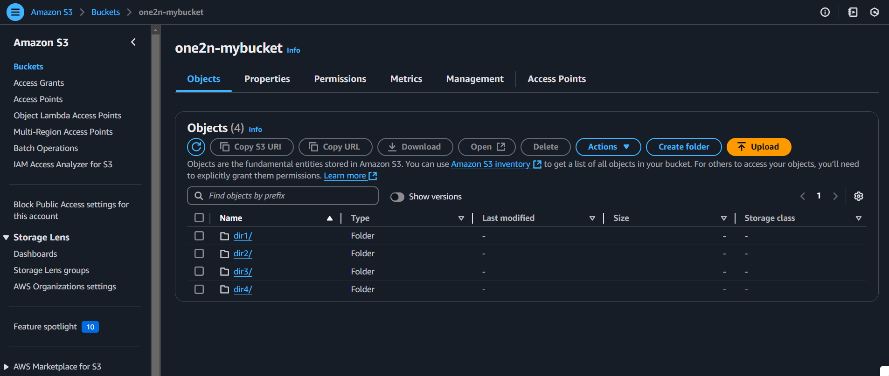
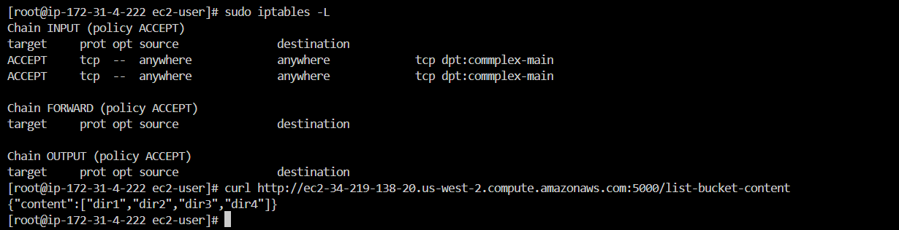
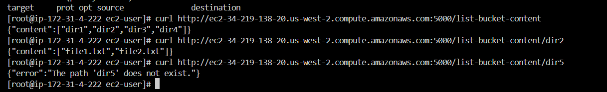
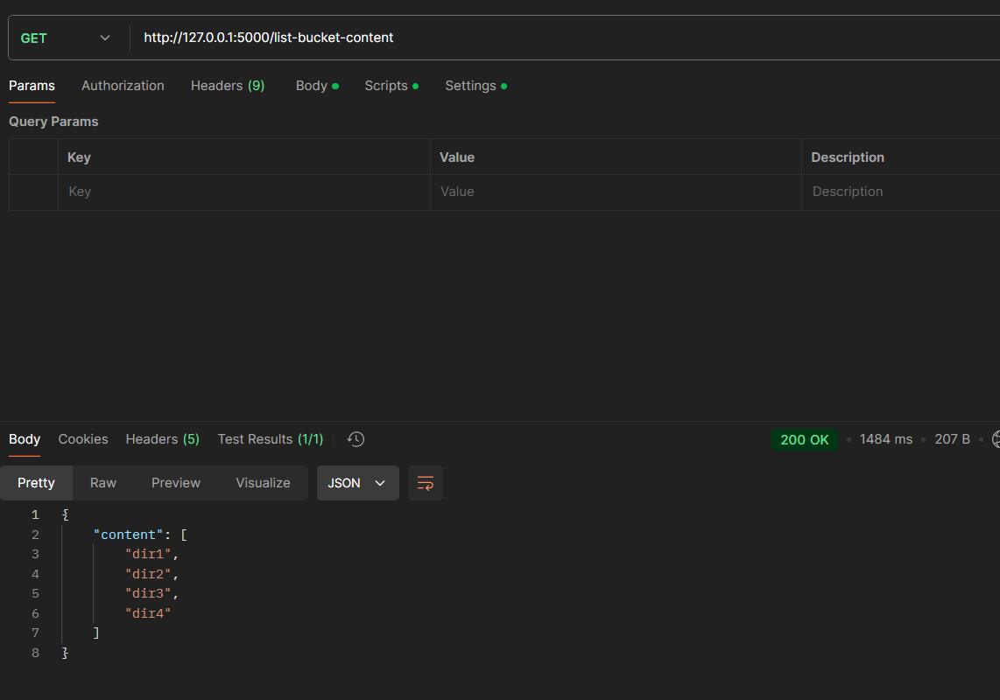
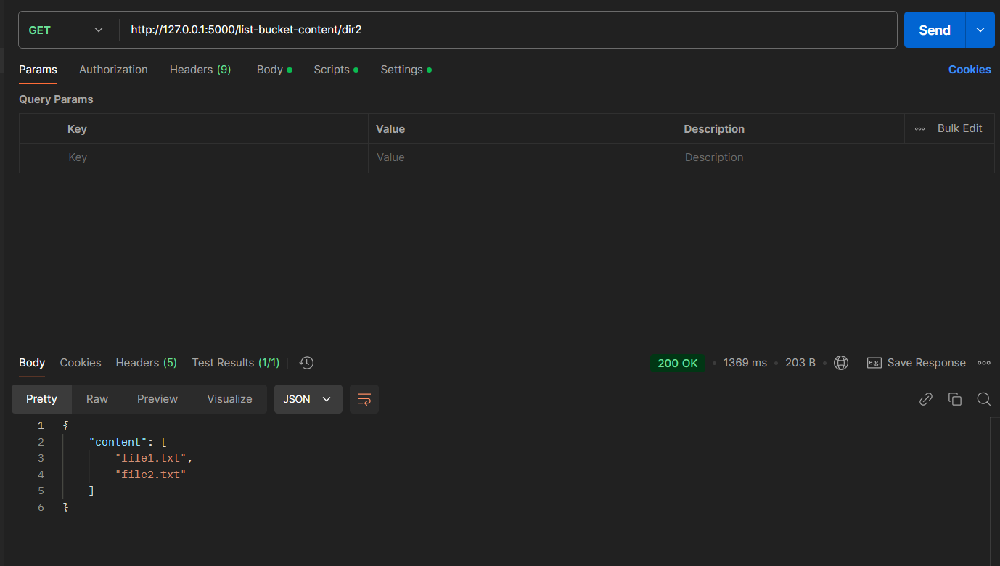

# list-bucket-python

# S3 Bucket Listing API

This project is a Flask-based application that lists the contents of an S3 bucket. It is deployed on AWS EC2 using Terraform.

## API Endpoints

- **List top-level bucket contents**: `GET /list-bucket-content`
- **List contents of a directory**: `GET /list-bucket-content/<path>`

## How to Deploy

1. Clone the repository.
2. Ensure your AWS credentials are set up for Terraform.
3. Run `terraform init` and `terraform apply` to create the EC2 instance.
4. Access the API via `http://<EC2_PUBLIC_IP>:5000/list-bucket-content`.

## Screenshots

